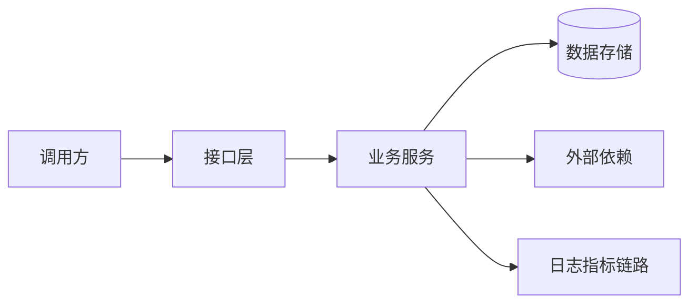

# 技术设计 — REQ-1 AI Tech Radar 产品体验与社区信号扩展

- 状态：已完成，待评审
- 负责人：timazc232
- GitHub Issue：https://github.com/timazc232/ai-tech-radar/issues/1
- 风险等级：R1
- 目标模块：connectors / pipeline / scoring / Today / Search / Sources / Jobs / Settings
- 最后更新：2026-08-17

## 1. 设计摘要

- 要解决的问题：来源不足、连续补丁刷屏、搜索无反馈、来源管理割裂、加载假空态、移动端密度与无障碍问题。
- 设计结论：复用 Collector 与统一管线；公开社区和可选社交 API 分层接入；选择层限额、展示层聚合；UI 局部渐进增强。
- 主要改动：5 个社区/社交源、2 个采集器、项目配额与更新串，以及搜索/来源/任务/移动端优化。
- 非目标：绕过平台认证、数据库迁移、依赖升级、自动发布。
- 核心风险：API 配额和社区噪声；通过安全跳过、热度门槛和单源失败隔离控制。

## 2. 现状与约束

- 入口和调用链：
- 现有组件及职责：
- 数据和外部依赖：
- 可复用实现：
- 兼容与发布约束：

## 3. 方案与取舍

| 方案 | 优点 | 缺点 | 风险/成本 | 结论 |
|---|---|---|---|---|
| 官方 API/RSS 接入现有管线 | 可追溯、可测试、合规 | X/Reddit 需凭据 | 配额/外部变化 | 采用 |
| 页面抓取 X/Reddit | 配置少 | 不稳定、条款风险 | 高 | 不采用 |
| 新聚合表 | 组关系可持久化 | 需要迁移 | 中 | 首期改用无迁移的选择/展示层聚合 |

## 4. 架构与流程

按真实系统修改节点，覆盖正常路径和关键失败路径。

## 5. 模块职责

| 模块 | 改动 | 输入 | 输出 | 失败处理 |
|---|---|---|---|---|

接口字段、错误码和示例统一写入 `接口文档.md`，此处只说明接口边界和调用关系。

## 6. 数据与兼容

- 表、字段和索引变化：
- 事务、并发与幂等：
- 迁移和回填：
- 新旧版本兼容：
- 回滚或前滚修复：

## 7. 安全与可靠性

- 认证、授权和数据范围：
- 输入校验和输出脱敏：
- 超时、重试、限流和降级：
- 审计要求：

## 8. 性能与可观测性

| 指标/日志/链路 | 当前基线 | 目标或阈值 | 验证/告警方式 |
|---|---|---|---|

## 9. 测试、发布与回滚

- 关键测试层和风险用例：
- 配置、数据库和部署顺序：
- 灰度与停止条件：
- 回滚步骤和验证：

## 10. 未决问题与评审

| 项目 | 负责人 | 截止 | 决定/来源 |
|---|---|---|---|
